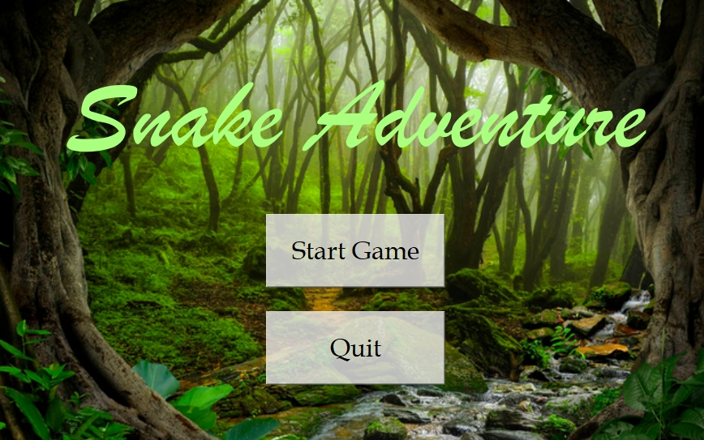
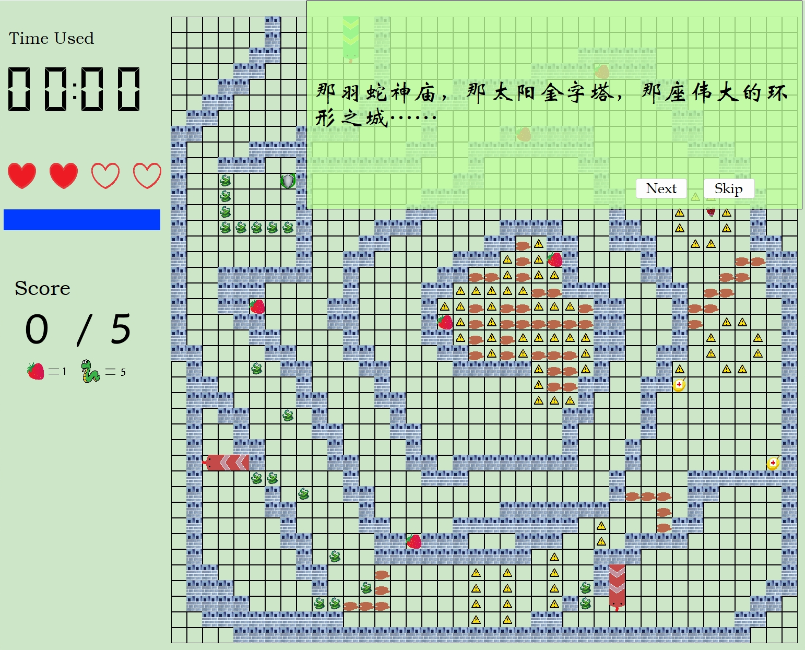
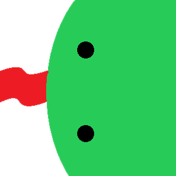
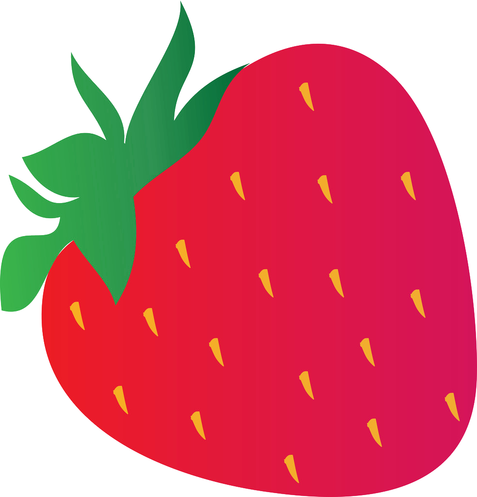
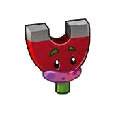
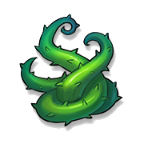
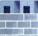
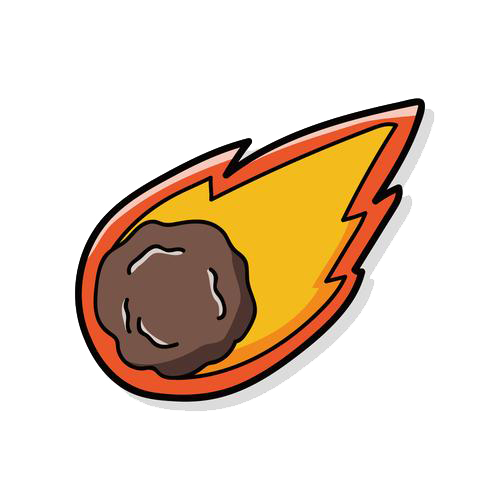
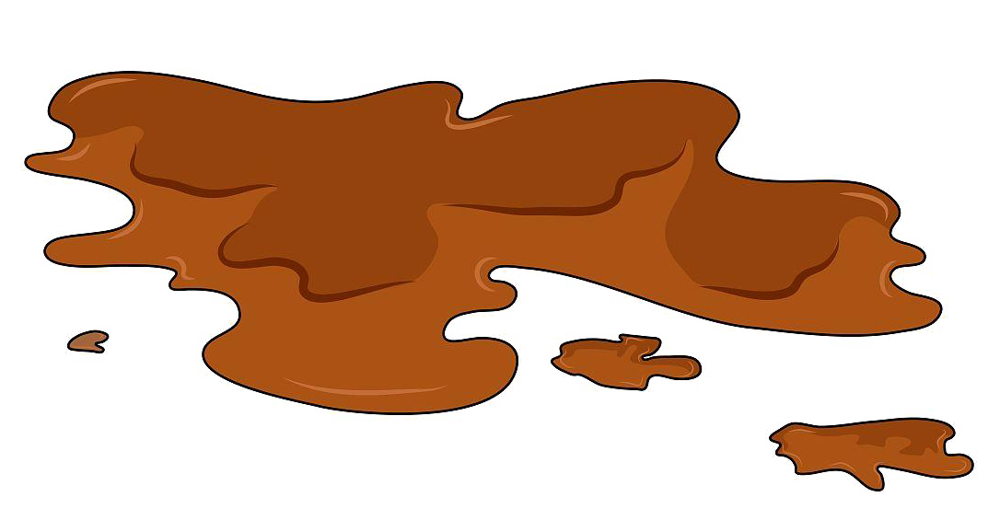
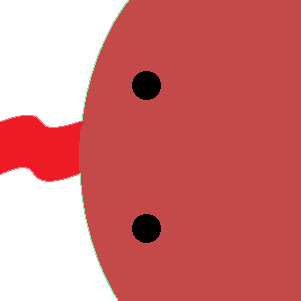

# Snake Adventure v1.0

<!-- [](https://spdx.org/licenses/MIT) -->
[](http://www.wtfpl.net/)

## 简介



**游戏背景**

一个王子受人迫害，被施法变成了一条蛇并流放到了边远之地，它在回程的旅途中，从由士兵变成的巡逻蛇那里发现了叔叔毒害父亲，意欲篡位的真相。王子历经千难万苦，终于回到了王国，完成了复仇。

**游戏特性**

相比于传统贪吃蛇游戏，我们增加了：
- 大量物品，包含正面效果的 buff 和负面效果的 debuff
- 关卡设计，按照剧情发展，每关会显示剧情和道具用途说明
- 难度设计，分为 easy，hard，nightmare，分别对应三种初始蛇的速度，通关后会根据完成的难度不同在关卡页面标记星级
- 增加了与人对战的电脑蛇元素，可以用身体撞击电脑蛇头击杀电脑蛇，完成相应的任务




**历史版本**

《Snake Adventure》 基于 Qt 开发，总代码量约 4100 行

目前在 Releases 中发布的是第 1 版可执行程序

```
* 2023.7.15 第一次发布程序 Snake Adventure v1.0.0
|
```

**文件关系**

```shell
SnakeAdventure
├─ guide/
    ├─ 1.txt
    ├─ ...
    └─ 12.txt
├─ image/
├─ map/
    ├─ addwallgame.txt
    ├─ 3.txt
    ├─ ...
    ├─ 11.txt
    └─ greedy.txt
├─ src/
├─ ui/
├─ record.txt
└─ snakeadventure.pro
```
* `guide/` 是每关剧情
* `image/` 是 Qt 用到的所有贴图
* `map/` 是每关的地图，我们实现了一套生成地图和读取地图的方式
* `src/` 框架部分和 Qt 部分的源码
* `ui/` 是 Qt 自动生成的描绘窗口的格式文件
* `record.txt` 是本地记录玩家通关情况的文件
* `snakeadventure.pro` 是 Qt 构建完成的项目

## 如何运行 

- **运行环境要求**
    * Windows 10 及以后的版本
- **如果你想对项目进行构建**
    * 可以在 [Qt_creator](https://sjtueducn-my.sharepoint.com/:u:/g/personal/hxs001_sjtu_edu_cn/EZXSnpZZgn1OrzTGjWisaSMBTdiX5s1xL2C1rDQc1eLYew?e=pJRYLj) 中编译
    * Qt_creator 4.9 及以后的版本 或 Qmake 4.8 及以后的版本

## 整体框架

#### 1. 逻辑结构


#### 2. 游戏引擎

游戏的主体逻辑包含在 `Game` 中，在这之外嵌套了 `GameWidget` 的全局引擎

* `Game` 的主要作用是创建游戏，地图，物品，蛇，时钟等一局游戏中的所有信息； `GameWidget` 的主要作用是按照给定信息创建 `Game` 实例，完成对该实例中的运行逻辑 `SnakeAction()` 和 `runGame()` 的适时调用，并在全局对游戏进行监控和信息显示，根据 `Game` 实例返回的接口信息调用相应的 Qt 组件

* 为了调控多条蛇的不同速度，必须将每条蛇的时钟统一，因此 `Game` 的另一个主要作用就是起到 clock 信号的同步作用。在 `GameWidget` 中每隔 5 ms 调用一次 `Game.runGame()`，遍历 `Game.state` 中的每条蛇执行 `snakeAction(Snake* )`，并在其中更新**各自独立**的周期计数器 `cycle_record`，而蛇自己的 `ableMove()` 只有在周期计数器达到 `12 - Snake.speed` 的时候才会执行移动动作

**于是通过更改每条蛇的 `speed` 就可以更改它们各自的速度**

#### 3. 物品实现


`Item` 父类记录物体位置 `Loc loction` ，判断击中蛇的遍历函数 `hitSnakeHead()` `hitSnakeBody()`

所有物品子类继承 `Item` ，重写 `action(Snake*)` 实现各自的功能，`getName()` 函数用于返回各自类别，用于外部 `Item*` 指针对物品类型的获取

#### 食物 `Food` （树莓）
- 普通食物，增加的长度默认为 1, 可通过 `Food::changeAddLength()` 修改

#### 吸铁石 `Magnet` （磁力菇）

- 让传入的 `Snake` 实例在 `effective_time` 时间里能吸收头部四周九宫格的 `Food`

- `effective_time` 跟随全局时钟变化，每个时钟周期减少；在此期间遇到新的 `Magnet` 会更新有效时间，不会叠加时间

- 运行逻辑：在全局每轮 `runGame()` 中对每条蛇的行动中，检查是否 `snake.ableMagnetic()` ，如果 `magnetic > 0` 则对四周不属于蛇的身体的格子进行遍历检查，并吸收其中的 `Food` 类

#### 护盾 `Shield` （还魂草）

- 让传入的 `Snake` 实例具有护盾, 当血量降为 0 或撞击任何触发死亡的物品时，在出生点复活并保留原来一定的长度；已吃过的食物和已击杀的蛇数据不会丢失

- 运行逻辑：在 `snake.death()` 中增加了对护盾的判断，如果存在护盾则调用 `initialize()` 在复活点新建一条蛇，并将 `this` 的全部信息迁移过去；若不存在护盾，则直接将血量设为 0 并以 `true` 将死亡信息传递出去

#### 血包 `Firstaid` （续命果）

- 血包，增加的血量默认为 1, 最多达到最大血量
- 调用传入的 `Snake` 实例 `snake.addhealth(add_health)`

#### 障碍 `Obstacle` （毒荆棘）

- 不同障碍物有不同伤害量，默认为 1
- 调用传入的 `Snake` 实例 `snake.addhealth(-injury)`

#### 墙 `Wall` （石墙）

- 和地图边界相同，撞击即触发死亡

- 运行逻辑：在 `snakeAction()` 中每次执行完前进 `snake.move()` 后，都检查蛇头位置，是否撞墙，或超出边界，或撞击自己身体，或撞击其他蛇身体

#### 陨石 `Aerolite` （天降巨石）

- 砸中头部死亡，砸中身体则从砸中处截断以后部分；在掉落之前有警告符号

- 运行逻辑：所有陨石的掉落都依赖于全局时钟的计算，因此在 `runGame()` 中进行检查 `isFall()` ；如果掉下，对蛇进行检查判断哪颗陨石砸到了身体，并调用 `touchAerolite()->action()`

#### 沼泽 `Marsh` （泥潭）
- 只要蛇任何一部分在沼泽上，都将被减速

- 运行逻辑：为了减少运算量，对触碰沼泽的检查在 `snake.touchMarsh()`中，每轮 `runGame()` 对每条蛇调用该函数，是则调慢该蛇 `speed` ，并在每轮开始前 `snake.recover()` ，即在下一次判断沼泽前将速度恢复，最终减速时间应为一个时钟周期的暂停时间


## UI设计（Qt）

#### 1. 控件之间的关联逻辑

利用 Qt 特有的信号 `signal` 与槽 `slot` 函数实现连接。除去基本的窗口显示、关闭外，在 `qlevel`（关卡选择界面类）通过设计不同按钮的槽函数达到选关效果；在 `gamewidget`（游戏界面类）通过信号函数的不同参数，控制 `dialog`（游戏结束界面类）显示游戏胜利或游戏失败

#### 2. 键盘输入控制

重载 `QWidget` 类的 `KeyPressEvent()` 与 `KeyReleaseEvent()` 函数，不同的按键与蛇的方向变换、加速函数相关联

#### 3. 游戏界面绘制

重载 `QWidget` 类的 `paintEvent()` 函数，利用 `QPainter` 控制画笔来绘制格子，利用不同的 `QLabel` 实例来显示物品、蛇、倒计时以及其他贴图

#### 4. 物品的绘制

物品图案均用 `QLabel` 实例储存。物品分为地形物品、交互物品与陨石。地形物品（墙、沼泽）在游戏初始化时被画好；交互物品（食物、磁铁、血包、护盾、障碍）的绘制借用了滑动窗口的思想，在每次循环时，检查与前一次循环相比有哪些物品删去，有哪些物品增加，并相应删去或新建 `QLabel` 实例；陨石与警告图案在游戏初始化时被储存，在循环时判断是否显示，并依次调用 `QLabel` 的 `hide()` 与 `show()` 函数。

#### 5. 蛇的绘制

蛇的绘制与交互物品的绘制较为相似， `paintSnake()` 函数每次只传入蛇的序号与蛇的长度变化，根据长度变化的正负来删去或新建 `QLabel` 实例，剩余原有的 `QLabel` 实例只需判断与前一次循环相比，该段身体的方向是否一致，只有不一致时才重新创建 `QLabel` 实例。


## 电脑 Snake 


继承 `Snake` 类，构建 `AIsnake` 类作为接口，后实现基于不同算法的 AIsnake（受限于时间原因，只实现了两个基本的 AIsnake）

#### `GreedyFood`

- 贪婪的寻找食物的蛇
- 实现细节：基于广度优先搜索，寻找食物，并前往食物

#### `WalkingSnake`

- 巡逻蛇，沿固定路径点巡逻的蛇
- 实现细节：基于 `AIsnake` 类中的 `go_to` 函数，加上队列数据类型的特性实现

## 关卡设计

`Game.level` 改变蛇初始的移动速度，使得玩家操作难度不同，根据挑战的不同难度，通关后有不同星级的显示

**第一关** 基础关卡， 与经典版贪吃蛇的逻辑一样，胜利目标是吃够足够的食物

**第二关** 加入墙，沼泽，以及 `Ctrl` 加速功能

**第三关** 整合了前两关的新增功能，本关给玩家提供了两种通关路径，既可以完整走过中间的迷宫，也可以在沼泽遍布的外面吃完食物通关

**第四关** 加入巡逻蛇，本关引入了一个新的通关目标，既消灭其他蛇

**第五关** 加入吸铁石，玩家必须利用吸铁石吸附周围食物的特性通过中间的小道来通关

**第六关** 加入血包和障碍物，玩家需要计算自己的血量并合理规划路径来通关

**第七关** 复杂化路径

**第八关** 复杂化路径

**第九关** 加入护盾，玩家需要利用地图上遍布的护盾的复活功能来选择性破除石墙的阻碍，以获得更方便的道路

**第十关** 加入陨石，玩家需要判断合适的时机通过陨石阵

**第十一关** 剧情的结尾关卡，整合所有物品

**第十二关** 彩蛋关，趣味杀蛇模式

## 关于项目

#### 组员分工

* 陶瑞
    * 实现程序框架
    * 实现游戏运行逻辑
    * 设计小部分关卡
    * 代码测试和 debug

* 朱晟嘉
    * 实现 Qt 图形化界面
    * 与 Qt 的逻辑接口
    * 剧情设计和艺术设计
    * 代码测试和 debug

* 韩潇申
    * 实现 AISnake
    * 设计大部分关卡
    * 实现关卡的地图生成和载入
    * Git main 分支维护
    * 代码测试和 debug

#### 正在维护的方向

- 加入时间触发、位置触发等道具触发方式，陨石改成单独计时
- 代码规范


#### 继续可能的方向

- AISnake 可以使用更有智力的算法，比如利用 ppo，ddpg 等实现可以完成躲避、击杀的蛇
- 无尽模式和排行榜
- 排行榜的联网同步

------

#### 关于我们

我们是上海交通大学 IEEE 试点班 2022 级大一学生，欢迎对我们的项目提出修改建议

⭐ 可以通过以下方式联系我们 ~ ⭐

* 陶瑞：taorui_sjtu@sjtu.edu.cn
* 朱晟嘉：kepler_452b@sjtu.edu.cn
* 韩潇申：hxs001@sjtu.edu.cn


